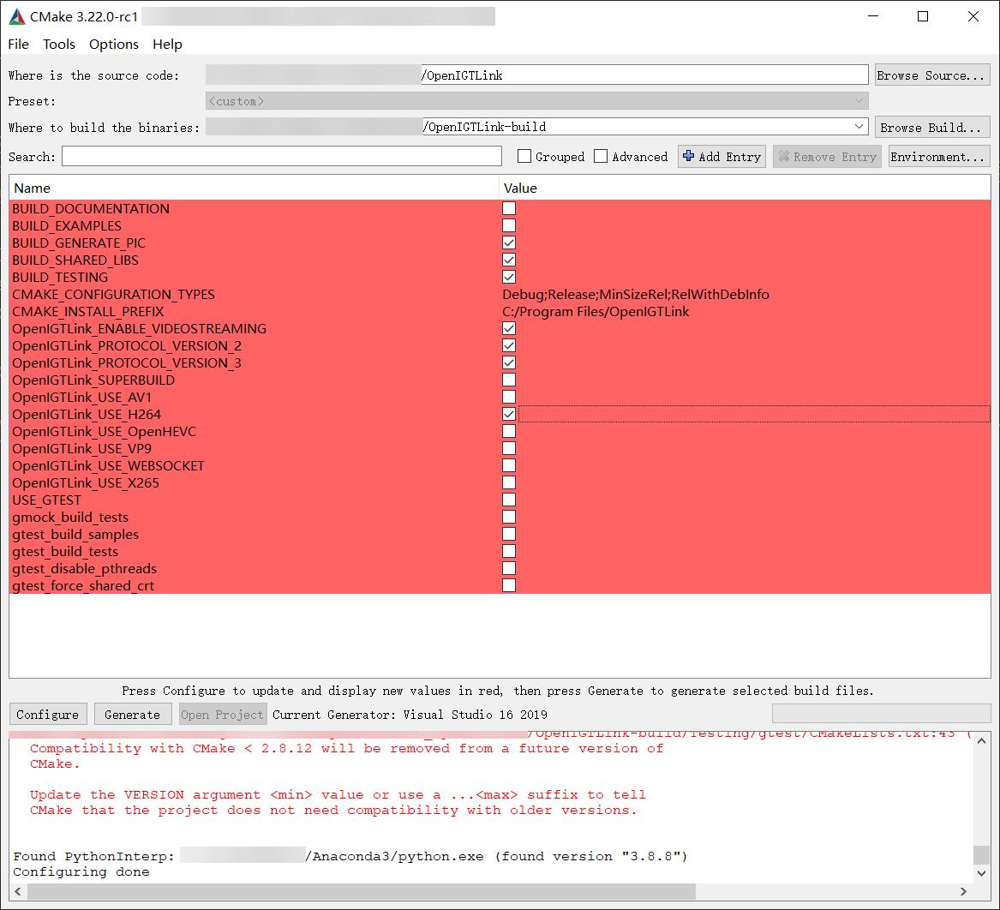

# Matlab_OpenIGTLink

> This repo is about building OpenIGTLink used by Matlab in Windows.

## Requirements
- Windows 10 Pro for Workstations 21H1
- Matlab R2021b
- Visual Studio Professional 2019
- [CMake 3.22.0-rc1](https://github.com/Kitware/CMake/releases/download/v3.22.0-rc1/cmake-3.22.0-rc1-windows-x86_64.msi)
- For OpenH264, you also need [MSYS2 x86_64-20210725](https://github.com/msys2/msys2-installer/releases/download/2021-07-25/msys2-x86_64-20210725.exe) and [NASM 2.15.05 x64](https://www.nasm.us/pub/nasm/releasebuilds/2.15.05/)

## Step 1, pre-configuration for OpenIGTLink
1. Run CMake, Where is the source code: `path\to\OpenIGTLink`, Where to build the binaries: `path\to\OpenIGTLink-build`.
Click "Configure" and select your compiler (usually just click "OK")
2. Click "Configure", Message: "Build directory does not exit, should I create it?" - click "OK".
3. Select your compiler: First Selector: Visual Studio 16 2019 - click "Finsh" (Maybe you should try several times in China ^_^) (How to set Proxy in cmake: Click `Environment Editor` and add variables: `HTTP_PROXY` with value `http://127.0.0.1:xxxx`, `HTTPS_PROXY` with value `http://127.0.0.1:xxxx`)
4. Select like this  (If you do not need `VideoStream` and `OpenH264`, you can deselect them and skip Step 2)
5. Click "Generate"

## Step 2, build OpenH264
1. Open `path\to\OpenIGTLink\OpenIGTLink.sln` with `Visual Studio Professional 2019` and build for the first time. The building process will fail. Ignoring errors because this building is for downloading deps.
2. Go to `path\to\OpenIGTLink-build\Deps\openh264`
3. Copy `path\to\Tools\build_openh264.bat` to `path\to\OpenIGTLink-build\Deps\openh264`. You should change paths in `build_openh264.bat` according to your `Visual Studio Professional 2019`, `MSYS2` and `NASM` installing path.
4. double-click `build_openh264.bat` in `path\to\OpenIGTLink-build\Deps\openh264` and waiting for building completely.

## Step3, build OpenIGTLink
1. Go back to `Visual Studio Professional 2019` and rebuild `OpenIGTLink`, you should build a **release version**, that is very important!!!. Otherwise, Matlab will throw a memory error.

## Step4, build MatlabIGTL
1. Run CMake, Where is the source code: `path\to\MatlabIGTL`, Where to build the binaries: `path\to\MatlabIGTL-build`.
Click "Configure" and select your compiler (usually just click "OK")
2. Click "Configure", Message: "Build directory does not exit, should I create it?" - click "OK".
3. Select your compiler: First Selector: Visual Studio 16 2019 - click "Finsh"
4. In Matlab, using `mex -setup` to set mex C and C++ builder as `Microsoft Visual C++ 2019`
5. Click "Generate"
6. Go to `Visual Studio Professional 2019` and build `MatlabIGTL`, you should build a **release version**, that is very important!!!. Otherwise, Matlab will throw a memory error.

## Step5, Package ALL